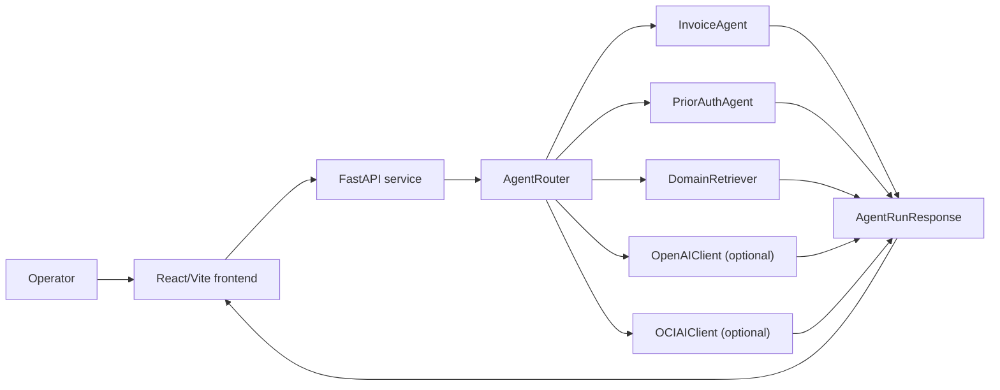
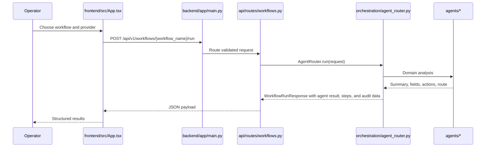
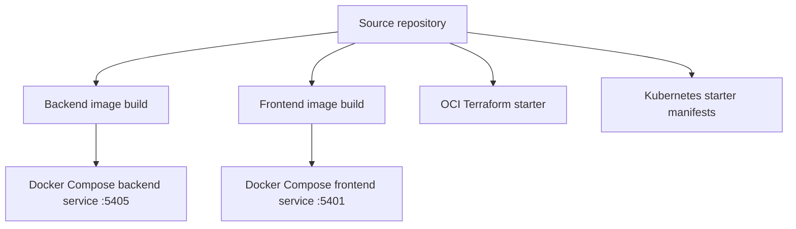
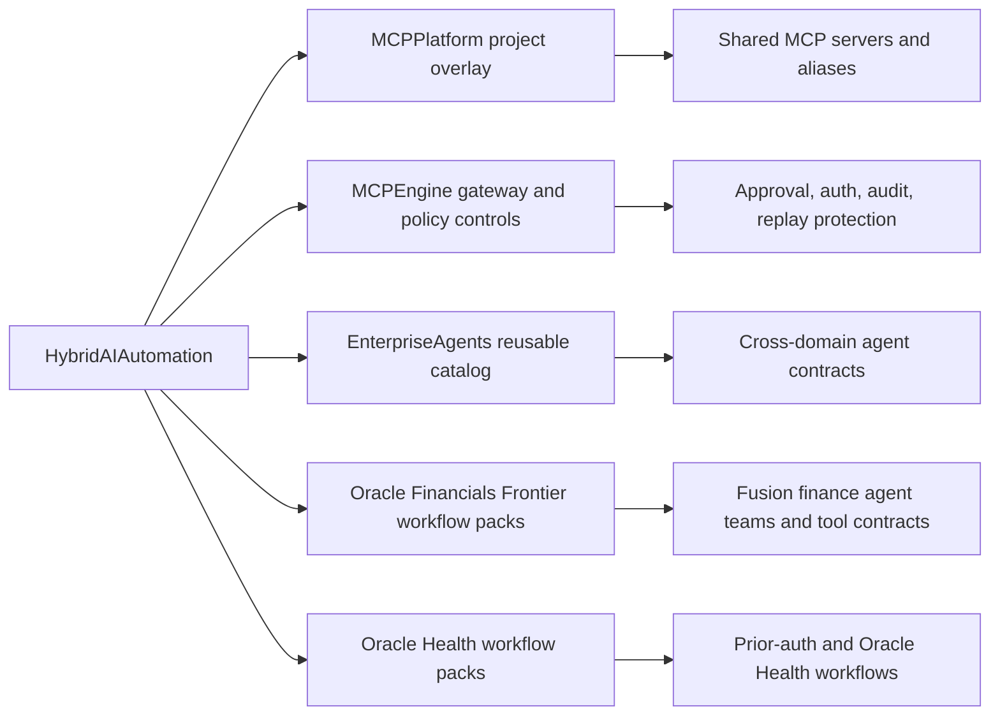

# Architecture Overview

Version: `0.4.0`
Last updated: `2026-04-29`

This repository is organized as a layered starter system:

- presentation layer for operator interaction
- API layer for request validation and routing
- domain logic layer for deterministic extraction and workflow decisions
- optional AI enrichment layer for external summarization
- deployment layer for local and future cloud execution

## System view

## Runtime request path

## Layer-by-layer breakdown

### Presentation layer

Primary file:

- `frontend/src/App.tsx`

Responsibilities:

- capture operator input
- submit agent requests
- show results in workflow-oriented cards
- surface errors and fallback notes

### API layer

Primary files:

- `backend/app/main.py`
- `backend/app/api/routes/agents.py`
- `backend/app/api/routes/workflows.py`
- `backend/app/api/routes/auth.py`
- `backend/app/api/routes/audit.py`
- `backend/app/core/schemas.py`

Responsibilities:

- initialize FastAPI
- expose health and docs endpoints
- define request and response schemas
- provide workflow, auth, audit, and agent execution endpoints

### Orchestration layer

Primary file:

- `backend/app/orchestration/agent_router.py`

Responsibilities:

- choose the domain agent
- control retrieval usage
- invoke optional AI enrichment
- attach mocked Oracle integration actions
- emit audit events for every execution
- preserve a consistent response contract

### Domain logic layer

Primary files:

- `backend/app/agents/invoice_agent.py`
- `backend/app/agents/prior_auth_agent.py`
- `backend/app/rag/retrieval.py`

Responsibilities:

- extract business fields from text
- compute routing targets
- generate next actions
- attach contextual policy snippets

### Enrichment layer

Primary files:

- `backend/app/ai/openai_client.py`
- `backend/app/ai/oci_ai_client.py`

Responsibilities:

- optionally replace the deterministic summary with provider-generated text
- fall back safely when credentials or endpoints are missing

### Deployment layer

Primary files:

- `docker-compose.yml`
- `backend/Dockerfile`
- `frontend/Dockerfile`
- `infrastructure/terraform/oci/main.tf`
- `infrastructure/kubernetes/deployment.yaml`

Responsibilities:

- enable local three-service bring-up with backend, frontend, and database
- define the first OCI infrastructure contract
- define baseline Kubernetes deployment objects

## Deployment view

## Current workflow coverage

- invoice processing
- prior authorization intake

The YAML workflow files describe the business flow, while the agent
implementations provide the executable domain logic.

## Intended extension points

- replace regex extraction with OCR and structured document parsers
- replace in-memory retrieval with a vector store or enterprise knowledge base
- add persistence, audit history, and approval tracking
- add authentication and role-based access
- connect OCI AI to a real tenancy-specific contract

## Reuse architecture from local projects

The review of `/Users/josekurian/AIAgents` shows that this repository should not
grow as an isolated starter. It should become a consumer of the more mature
shared assets already present locally.

### Recommended near-term target state

1. `HybridAIAutomation` keeps its current backend and frontend as the lightweight
   demo shell.
2. MCP configuration is generated from `MCPPlatform` overlays instead of being
   embedded ad hoc in app code.
3. secure tool execution and audit controls adopt `MCPEngine` patterns rather
   than growing a second parallel control plane.
4. Oracle finance and healthcare workflows are imported from the richer local
   catalogs, not rebuilt from scratch.

## Specific findings from the local portfolio

### MCP reuse

`AIAgents/AIAgentProjects/MCPPlatform` is already positioned as a single source
of truth for MCP servers, aliases, ports, allowlists, and shared security
controls. This is the right upstream system for this repo's eventual MCP layer.

### Control-plane reuse

`AIAgents/MCPEngine` already contains the patterns this repo still lacks:

- policy backends
- signed envelopes
- replay protection
- durable audit pipelines
- immutable external log replication

### Oracle Fusion finance reuse

`AIAgents/OracleFinancialsFrontierFullImplementation` already carries a much
deeper Oracle finance architecture than this starter:

- `50` workflow specs
- `100` agent specs
- typed tool contracts
- structured Responses API patterns
- background job and trace scorecard behavior

### Oracle Health reuse

The local Oracle Health extension already includes a broader prior-auth and
revenue-cycle catalog than the current healthcare starter, including workflow
IDs for denial recovery, prior auth approval, referral closure, and daily
revenue-cycle close.

## Gaps between this starter and the local mature assets

- no project-generated MCP overlay consumption yet
- no typed tool registry or tool-contract map
- no approval-ticket enforcement for protected actions
- no persistent trace scorecards or evaluation packs
- no reusable Oracle Fusion workflow import path
- no OCI-native vector search or file-search-backed retrieval layer
