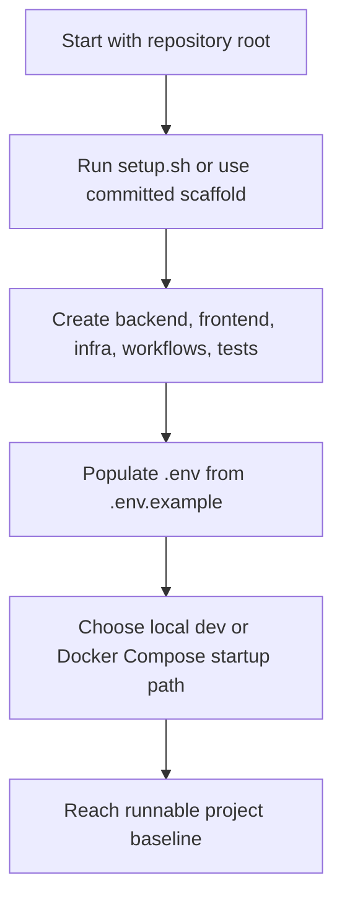

# Phase 1: Foundation and Bootstrap

Version: `0.4.0`
Last updated: `2026-04-29`

## Objective

Establish a reproducible local project that can be started, extended, and
documented without requiring external services on day one.

## Primary artifacts

- `setup.sh`
- `.env.example`
- `docker-compose.yml`
- `backend/`
- `frontend/`
- `infrastructure/`
- `workflows/`
- `tests/`

## Detailed steps

### Step 1: Create the directory skeleton

The bootstrap layer creates the major functional areas:

- backend API and orchestration code
- frontend operator console
- infrastructure assets
- workflow definitions
- tests and helper scripts

This is handled by `setup.sh`, which is idempotent and safe to rerun because it
creates directories and touches files without deleting existing content.

### Step 2: Define environment defaults

`.env.example` captures the minimum runtime contract:

- local application mode
- API prefix
- default provider selection
- optional OpenAI settings
- optional OCI settings
- frontend API base URL

This keeps local startup deterministic while preserving extension points.

### Step 3: Establish runnable service boundaries

The repository separates concerns immediately:

- `backend/` contains the FastAPI service and business logic
- `frontend/` contains the React UI and build toolchain
- `infrastructure/` captures future deployment targets rather than mixing them
  into app code

This prevents early coupling between runtime code and deployment templates.

### Step 4: Define the local bring-up path

`docker-compose.yml` provides the first operational baseline:

- build the backend image
- build the frontend image
- expose the backend on `5405`
- expose the frontend on `5401`
- include a Postgres-compatible database service for future vector and audit expansion

This makes the starter usable by someone who does not want to install Python and
Node toolchains manually.

### Step 5: Add guardrails for clean repository behavior

`.gitignore` excludes:

- `.env`
- `node_modules`
- generated build output
- Python caches
- TypeScript build info

## Version 0.4.0 update

The local portfolio review changes the intended outcome of this phase. The
bootstrap should no longer be viewed as only a blank-project creator. It should
be viewed as the thin delivery shell that will later consume:

- `MCPPlatform` project overlays
- `MCPEngine` policy and audit controls
- Oracle Fusion and Oracle Health workflow catalogs from `AIAgents`

This matters because the project mixes Python and Node assets and would
otherwise accumulate noisy local artifacts quickly.

## Deliverables at the end of this phase

- a consistent file structure
- a documented environment contract
- a local startup path
- a clean source-control baseline

## Diagram

## Exit criteria

- the repository contains all functional directories
- environment settings are documented
- startup options are clear
- source-control ignore rules are in place
