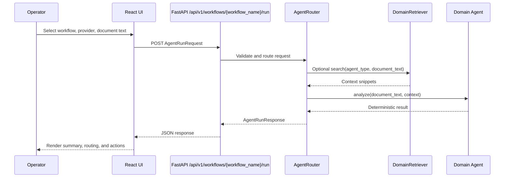

# Phase 2: Request Intake and Routing

Version: `0.4.0`
Last updated: `2026-04-29`

## Objective

Accept document text from the operator console or API client, validate the
request, and route it to the correct domain agent and summary provider path.

## Code anchors

- `backend/app/main.py`
- `backend/app/api/routes/agents.py`
- `backend/app/core/schemas.py`
- `backend/app/orchestration/agent_router.py`

## Detailed steps

### Step 1: Expose the API service

`backend/app/main.py` initializes the FastAPI application, configures CORS, and
mounts the agent routes under the configured API prefix.

Operational impact:

- frontend requests can be served from a different local origin
- the API is discoverable through `/docs`
- the route prefix can be changed without rewriting route handlers

### Step 2: Accept a structured agent request

`AgentRunRequest` defines the runtime contract:

- `agent_type`
- `document_text`
- `provider`
- `metadata`
- `use_retrieval`

This ensures the router receives typed, explicit inputs rather than inferring
behavior from loosely shaped JSON.

### Step 3: Route by business domain

`AgentRouter.run()` chooses the execution path:

- `invoice` requests go to `InvoiceAgent`
- `prior_authorization` requests go to `PriorAuthAgent`

This routing is deterministic and based on the declared request, not on
heuristics.

### Step 4: Decide whether retrieval is active

If `use_retrieval` is true, the router queries `DomainRetriever` before agent
analysis. If false, the agent executes with no contextual snippets.

This makes retrieval optional and easy to disable during debugging or isolated
testing.

### Step 5: Preserve a consistent response shape

Every request returns `AgentRunResponse`, which includes:

- summary
- extracted fields
- next actions
- routing target
- confidence
- retrieved context
- processing notes

That single schema keeps the frontend simple and ensures each agent returns a
comparable result structure.

## Diagram

## Version 0.4.0 update

This phase now has a clearer future target: request routing should eventually
support both local workflow names and imported catalog-backed workflow IDs from
the broader `AIAgents` portfolio, especially Oracle finance and Oracle Health
teams already modeled elsewhere.

## Exit criteria

- requests are validated at the API boundary
- routing is explicit and deterministic
- retrieval can be enabled or disabled
- the response contract is stable across agent types
