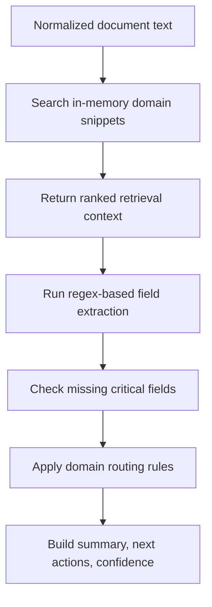

# Phase 3: Retrieval and Domain Analysis

Version: `0.4.0`
Last updated: `2026-04-29`

## Objective

Combine lightweight domain context with deterministic extraction logic to
produce a dependable first-pass business decision before any external AI service
is involved.

## Code anchors

- `backend/app/rag/retrieval.py`
- `backend/app/agents/invoice_agent.py`
- `backend/app/agents/prior_auth_agent.py`

## Detailed steps

### Step 1: Normalize the input text

Both domain agents collapse whitespace and analyze a normalized string. This
reduces sensitivity to OCR line breaks and uneven spacing.

### Step 2: Retrieve domain hints

`DomainRetriever` uses keyword overlap against a small in-memory corpus.

Current behavior:

- select snippets only from the matching business domain
- rank them by keyword overlap
- return the highest scoring items
- fall back to default domain snippets when overlap is zero

This is intentionally simple but useful for explaining why a route or escalation
occurred.

### Step 3: Extract structured fields

The domain agents use explicit regex patterns to pull out known business data.

Invoice fields:

- invoice number
- vendor
- amount due
- due date
- purchase order number

Prior authorization fields:

- patient name
- member ID
- payer
- diagnosis
- procedure
- ordering provider

### Step 4: Detect missing critical data

Each agent defines a small set of fields that must exist for a high-confidence
result. Missing values reduce confidence and trigger operator-facing next
actions.

This is important because it makes incompleteness visible rather than silently
pretending the document was fully parsed.

### Step 5: Convert extracted values into routing decisions

The agent logic then applies domain-specific rules:

Invoice rules:

- if amount is `>= 10000`, escalate to `finance.ap_high_value`
- otherwise route to `finance.ap_standard`
- if a PO is present, require matching
- if no PO is present, request confirmation of non-PO spend

Prior authorization rules:

- if high-acuity keywords are present, escalate to `healthcare.medical_review`
- otherwise route to `healthcare.utilization_review`
- always confirm eligibility and diagnosis-to-procedure alignment

### Step 6: Score confidence

Confidence starts from a business-specific base and is adjusted based on:

- count of missing critical fields
- presence of retrieval context

This keeps confidence explainable rather than model-derived and opaque.

## Version 0.4.0 update

The current retrieval logic is still intentionally lightweight. The strongest
upgrade path is to replace the in-memory snippet approach with OCI or OpenAI
file-search-backed retrieval and Oracle AI Vector Search, while preserving the
current explainability contract.

## Diagram

## Exit criteria

- extraction works without external AI configuration
- routing decisions are reproducible
- missing data is surfaced explicitly
- retrieval context is attached for operator review
