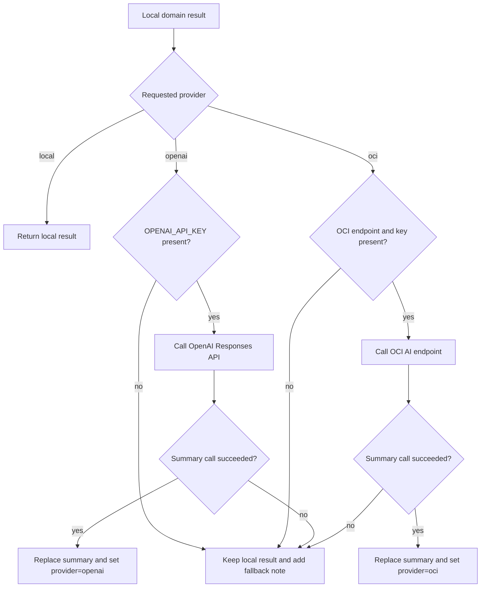

# Phase 4: AI Enrichment and Fallback

Version: `0.4.0`
Last updated: `2026-04-29`

## Objective

Allow the platform to enhance local results with external summaries while
protecting the deterministic workflow from provider outages or missing
credentials.

## Code anchors

- `backend/app/ai/openai_client.py`
- `backend/app/ai/oci_ai_client.py`
- `backend/app/orchestration/agent_router.py`

## Detailed steps

### Step 1: Finish local analysis first

The router always runs the local domain agent before external AI calls. That
means routing targets, extracted fields, and next actions exist even when a
provider is unavailable.

### Step 2: Inspect the requested provider

The incoming request can choose:

- `local`
- `openai`
- `oci`

`local` returns the deterministic result immediately.

### Step 3: Attempt provider enrichment

OpenAI path:

- require `OPENAI_API_KEY`
- build a summary prompt from the deterministic result
- call the OpenAI Responses API
- extract returned text

OCI path:

- require endpoint and API key
- send a summary request to the configured endpoint
- extract returned text from a flexible JSON shape

### Step 4: Handle provider unavailability safely

If a provider is not configured or fails:

- keep the original local result
- append a processing note
- mark the request as `completed_with_fallback` when appropriate

This prevents external dependencies from blocking operational output.

### Step 5: Preserve the same response schema

Even when provider enrichment succeeds, the response shape stays the same. Only
the summary text and provider value change.

This is a deliberate compatibility rule for the frontend and future API clients.

## Diagram

## Version 0.4.0 update

This phase now has two realistic expansion paths:

- OpenAI Responses API with remote MCP servers, connectors, structured outputs,
  and background workflows
- OCI Enterprise AI and OCI Generative AI Enterprise AI agents for OCI-native
  deployment with OpenAI-compatible request patterns

## Exit criteria

- local behavior remains primary
- provider enrichment is optional
- failures degrade gracefully
- operators can see fallback notes
