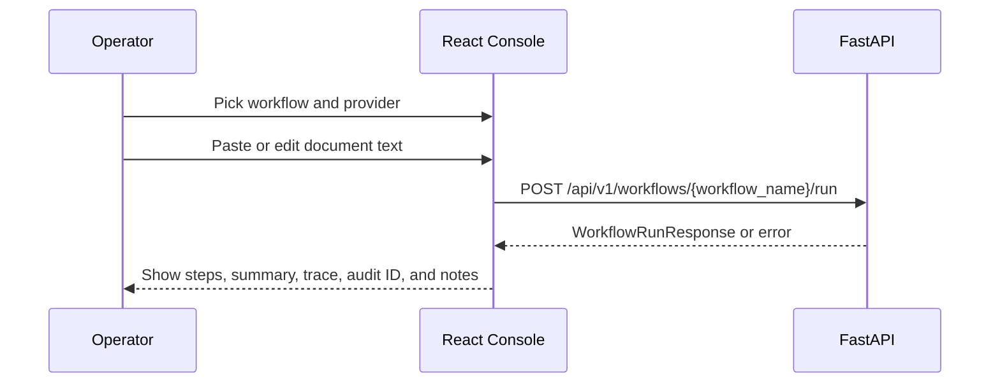

# Phase 5: Frontend Operator Console

Version: `0.4.0`
Last updated: `2026-04-29`

## Objective

Give an operator a single-screen console for choosing a workflow, submitting a
document sample, and reviewing the system’s structured outcome.

## Code anchors

- `frontend/src/App.tsx`
- `frontend/src/styles.css`

## Detailed steps

### Step 1: Preload usable sample documents

The UI ships with sample invoice and prior-authorization text. This matters
because a new user can validate the end-to-end flow immediately without hunting
for input data.

### Step 2: Collect workflow intent

The operator chooses:

- agent type
- provider type
- document text

These map directly to the backend request schema.

### Step 3: Submit the request

The form sends a `POST` request to:

- `VITE_API_BASE_URL + /api/v1/workflows/{workflow_name}/run`

The request body contains:

- `provider`
- `document_text`
- `use_retrieval`

The selected workflow maps to the appropriate domain agent on the backend.

### Step 4: Manage asynchronous UI state

The UI uses:

- `useState` for local state
- `useTransition` for non-blocking result updates
- `useDeferredValue` for lightweight live document-length feedback

This keeps the UI responsive even when requests take longer than local demos.

### Step 5: Render operational outputs

The results panel breaks the response into operator-friendly cards:

- summary
- extracted fields
- next actions
- retrieved context
- processing notes

This is important because raw JSON is not a usable operational view.

### Step 6: Surface request failures explicitly

If the request fails, the UI clears stale results and shows an error box. This
prevents the user from mistaking the last successful response for a fresh one.

## Diagram

## Version 0.4.0 update

The frontend should remain the fast demo layer, but the next customer-facing
improvement is to expose imported workflow packs and team labels from the local
Oracle finance and healthcare catalogs rather than only the two starter flows.

## Exit criteria

- an operator can exercise both workflows from one page
- provider selection is explicit
- request status is visible
- structured outputs are readable without inspecting raw JSON
