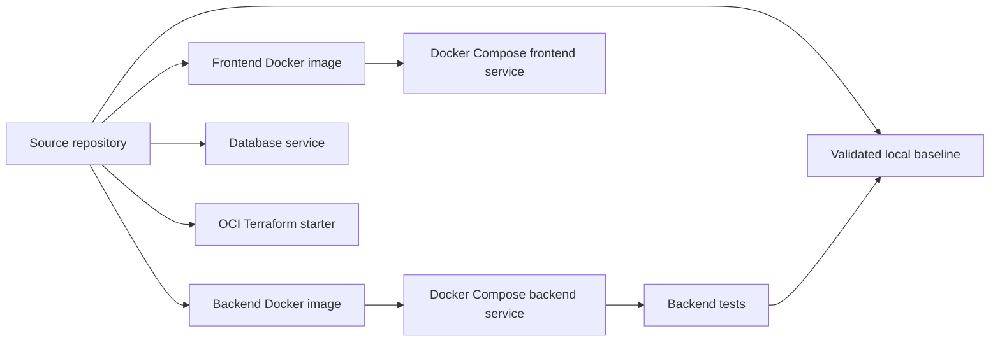

# Phase 6: Deployment, Validation, and Extension

Version: `0.4.0`
Last updated: `2026-04-29`

## Objective

Move the starter from source code into an executable local environment, verify
the baseline behavior, and define the next phases toward production readiness.

## Code anchors

- `docker-compose.yml`
- `backend/Dockerfile`
- `frontend/Dockerfile`
- `infrastructure/terraform/oci/main.tf`
- `infrastructure/kubernetes/deployment.yaml`
- `tests/test_api.py`

## Detailed steps

### Step 1: Package the backend

The backend Docker image:

- starts from `python:3.12-slim`
- installs `backend/requirements.txt`
- copies the FastAPI app
- launches Uvicorn on port `8000`

### Step 2: Package the frontend

The frontend Docker image:

- starts from `node:20-alpine`
- installs npm dependencies
- builds the production bundle
- serves the preview app on port `3000`

### Step 3: Compose the local runtime

`docker-compose.yml` defines three services:

- `backend`
- `frontend`
- `db`

This creates a clean separation between the frontend experience, backend
processing path, and pilot database service while still being easy to start locally.

### Step 4: Validate backend behavior

`tests/test_api.py` verifies:

- health endpoint availability
- invoice routing
- prior-authorization routing

These tests confirm the critical domain branches work before any UI or
deployment work is considered trustworthy.

### Step 5: Maintain infrastructure placeholders

The infrastructure layer is intentionally a starter:

- OCI Terraform defines provider and common tags
- Kubernetes manifests define baseline deployments and services

This provides a documented path forward without pretending deployment
automation is production-complete.

### Step 6: Define the next implementation phases

Logical future phases after this starter are:

- OCR and document ingestion
- persistence and audit history
- authentication and role-based access
- queue-driven orchestration
- real vector retrieval
- production OCI deployment hardening

## Diagram

## Version 0.4.0 update

Deployment guidance is now better framed as a staged progression:

1. current local Docker demo
2. OCI Enterprise AI or Oracle Fusion-connected pilot environment
3. shared MCP services from `MCPPlatform`
4. hardened gateway, approvals, and durable audit from `MCPEngine`
5. production OCI deployment with real Oracle integrations

## Exit criteria

- local containers can be built and started
- core API tests pass
- deployment starter assets exist
- future hardening phases are documented explicitly
