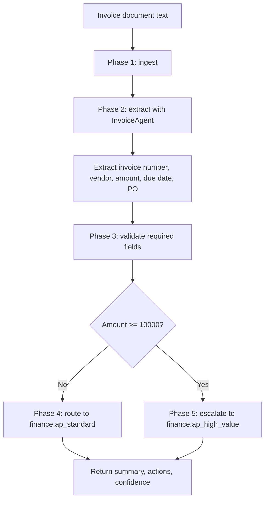

# Invoice Workflow Guide

Version: `0.4.0`
Last updated: `2026-04-29`

## Workflow source

- `workflows/invoice_processing.yaml`
- `backend/app/agents/invoice_agent.py`

## Workflow objective

Process an invoice document, extract its operationally important fields, and
determine whether it should stay in standard accounts payable processing or be
escalated for higher-value approval.

## Phase map

| Phase | Step ID | Action | Runtime meaning |
| --- | --- | --- | --- |
| Phase 1 | `ingest` | `receive_document` | Accept OCR text or operator-pasted invoice content |
| Phase 2 | `extract` | `run_agent` | Use the invoice agent to extract fields and generate a summary |
| Phase 3 | `validate` | `validate_required_fields` | Detect missing critical fields and issue operator actions |
| Phase 4 | `route` | `route_to_queue` | Send standard invoices to AP validation |
| Phase 5 | `approve_high_value` | `conditional_escalation` | Escalate invoices at or above the threshold |

## End-to-end diagram

## Detailed phases and steps

### Phase 1: Ingest

Purpose:

- receive invoice text from the frontend or direct API call

Inputs:

- raw invoice OCR output
- pasted invoice text

Outputs:

- normalized text ready for extraction

Operational notes:

- this starter does not include OCR
- the current expectation is that text already exists when the request arrives

### Phase 2: Extract

Purpose:

- turn unstructured invoice text into structured operational fields

Fields extracted today:

- invoice number
- vendor
- amount due
- due date
- purchase order number

Supporting logic:

- whitespace normalization
- regex extraction
- amount parsing to `Decimal`
- retrieval of policy snippets when enabled

Outputs:

- structured fields
- first-pass summary
- candidate routing target

### Phase 3: Validate

Purpose:

- determine whether the document is complete enough for downstream handling

Critical fields:

- invoice number
- amount due
- due date

Validation behavior:

- if critical fields are missing, the response includes a next action asking for
  document review or OCR correction
- confidence decreases as missing critical fields increase

Business value:

- prevents the workflow from silently routing low-quality document parses

### Phase 4: Route to Standard AP

Entry condition:

- amount is below `10000`, or amount could not trigger high-value escalation

Route target:

- `finance.ap_standard`

Next actions added:

- route to accounts payable for standard validation and posting
- if a PO exists, require invoice-to-PO matching
- if a PO is missing, request PO confirmation or non-PO justification

### Phase 5: Escalate High-Value Invoice

Entry condition:

- parsed amount is greater than or equal to `10000`

Route target:

- `finance.ap_high_value`

Next actions added:

- escalate to finance approval
- still require PO validation behavior where applicable

## Version 0.4.0 update

This starter workflow now maps clearly to broader Oracle finance reuse assets in
`AIAgents/OracleFinancialsFrontierFullImplementation`, especially:

- `ap_invoice_intake_triage`
- `duplicate_invoice_detection`
- `invoice_to_payment_status_tracking`
- `payment_hold_resolution`
- `supplier_invoice_exception_handling`

That makes invoice processing the best first expansion area for new customer
POCs because the local portfolio already contains richer next-wave workflows.

## Decision table

| Condition | Result |
| --- | --- |
| Missing invoice number, amount, or due date | Add remediation action and lower confidence |
| Amount `< 10000` | Route to `finance.ap_standard` |
| Amount `>= 10000` | Route to `finance.ap_high_value` |
| PO present | Add matching step |
| PO missing | Add request for PO or non-PO confirmation |

## Current limitations

- no OCR ingestion pipeline yet
- no vendor master lookup
- no persistence or approval history
- no ERP integration for posting or matching
