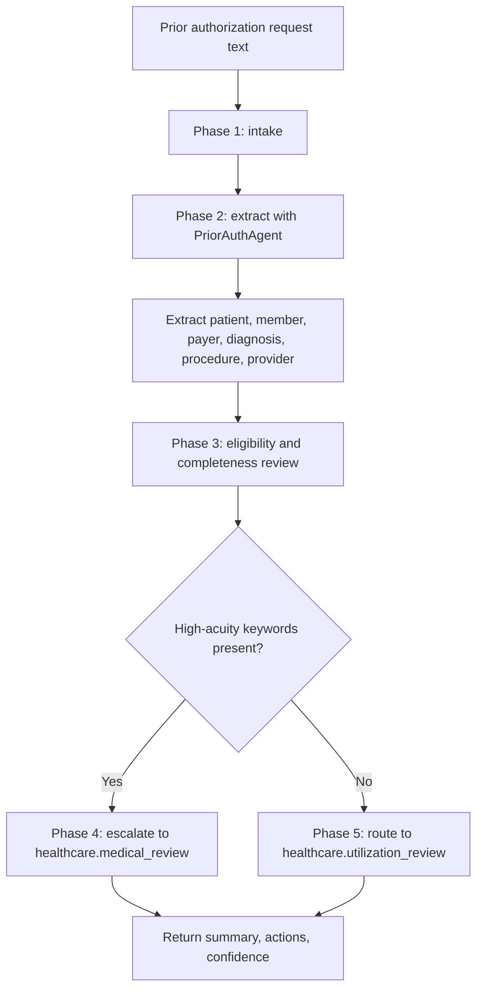

# Prior Authorization Workflow Guide

Version: `0.4.0`
Last updated: `2026-04-29`

## Workflow source

- `workflows/prior_authorization.yaml`
- `backend/app/agents/prior_auth_agent.py`

## Workflow objective

Process a prior-authorization request, extract member and clinical details, and
determine whether the case should remain in standard utilization review or be
escalated to medical review.

## Phase map

| Phase | Step ID | Action | Runtime meaning |
| --- | --- | --- | --- |
| Phase 1 | `intake` | `receive_request` | Accept request text from the UI or API |
| Phase 2 | `extract` | `run_agent` | Use the prior-auth agent to parse the request |
| Phase 3 | `eligibility` | `verify_member_eligibility` | Confirm the presence of key member and payer data |
| Phase 4 | `medical_review` | `conditional_escalation` | Escalate higher-acuity services |
| Phase 5 | `utilization_review` | `route_to_queue` | Route standard cases for utilization review |

## End-to-end diagram

## Detailed phases and steps

### Phase 1: Intake

Purpose:

- receive the authorization request text in a format ready for parsing

Inputs:

- copied request notes
- structured text converted from forms
- text produced by upstream OCR or transcription systems

Outputs:

- normalized request text

Operational notes:

- this starter assumes text is already available
- no payer portal or EHR integration is implemented yet

### Phase 2: Extract

Purpose:

- identify the patient, coverage, and clinical fields needed for utilization
  review

Fields extracted today:

- patient name
- member ID
- payer
- diagnosis
- procedure
- ordering provider

Supporting logic:

- whitespace normalization
- regex extraction
- retrieval of payer-rule snippets when enabled

Outputs:

- structured request details
- deterministic summary
- preliminary routing target

### Phase 3: Eligibility and Completeness Review

Purpose:

- make incompleteness visible before case routing

Critical fields:

- patient name
- member ID
- payer
- diagnosis
- procedure

Validation behavior:

- missing critical fields create explicit next actions
- standard next actions always include benefit coverage confirmation and
  diagnosis-to-procedure validation

Business value:

- prevents incomplete authorizations from appearing ready for review when they
  are not

### Phase 4: Escalate to Medical Review

Entry condition:

- request text contains a high-acuity keyword such as:
  - surgery
  - inpatient
  - oncology
  - infusion
  - mri

Route target:

- `healthcare.medical_review`

Next actions added:

- escalate to medical review due to service complexity

### Phase 5: Route to Utilization Review

Entry condition:

- no high-acuity keyword is detected

Route target:

- `healthcare.utilization_review`

Next actions added:

- confirm benefit coverage and payer-specific rules
- validate diagnosis-to-procedure alignment
- route to standard utilization review

## Version 0.4.0 update

The prior-authorization starter flow should evolve by reusing the broader Oracle
Health assets already present under `AIAgents`, especially:

- `oracle-health-prior-auth-approval`
- `oracle-health-denial-recovery`
- `oracle-health-referral-closure`
- `oracle-health-revenue-cycle-daily-close`

This gives a credible path from a single prior-auth demo toward a wider Oracle
Health revenue-cycle and utilization-management POC package.

## Decision table

| Condition | Result |
| --- | --- |
| Missing core member or clinical fields | Add remediation action and lower confidence |
| High-acuity keyword present | Route to `healthcare.medical_review` |
| No high-acuity keyword present | Route to `healthcare.utilization_review` |
| Retrieval enabled | Attach payer-rule context snippets |

## Current limitations

- no eligibility API integration
- no payer-specific rule engine
- no authorization status persistence
- no clinician review work queue yet
