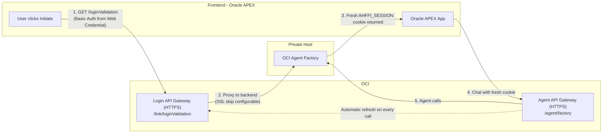

# Automatic Session Cookie Refresh

This folder preserves the unique worktree-only gateway demo that existed in the
detached `7807` HybridAIAutomation worktree.

It has been consolidated into the main `HybridAIAutomation` repository without
overwriting the current Oracle ERP and healthcare POC project structure.

## What This Demo Implements

- a `Login API Gateway` that performs `GET /link/loginValidation`
- an `Agent API Gateway` that refreshes the session on every agent call
- a `Private Host` backend that issues and validates the `AHFFI_SESSION` cookie

The Oracle APEX frontend referenced in the original notes is represented here
as the HTTP client that calls the gateways.

## Architecture



## Consolidated Files

- `services/private_host.py`
- `services/login_gateway.py`
- `services/agent_gateway.py`
- `scripts/smoke_test.py`
- `.env.example`
- `docker-compose.yml`

## Run Locally

### Option 1: Docker Compose

```bash
cd imported/session-cookie-refresh
docker compose up
```

Endpoints:

- Login gateway: `http://127.0.0.1:8000/link/loginValidation`
- Agent gateway: `http://127.0.0.1:8100/agent/factory`
- Private host demo endpoint: `http://127.0.0.1:9100/loginValidation`

### Option 2: Run Services Directly

```bash
python3 imported/session-cookie-refresh/services/private_host.py
python3 imported/session-cookie-refresh/services/login_gateway.py
python3 imported/session-cookie-refresh/services/agent_gateway.py
```

## Smoke Test

Once the three services are running:

```bash
python3 imported/session-cookie-refresh/scripts/smoke_test.py
```

The test checks that:

- login returns a fresh session cookie
- agent calls succeed
- the session cookie is refreshed on each call

## Notes

- This demo is preserved as imported worktree content, not yet integrated into
  the main FastAPI application.
- It stays isolated so it does not replace the current project `README.md`,
  `.env.example`, or `docker-compose.yml`.
